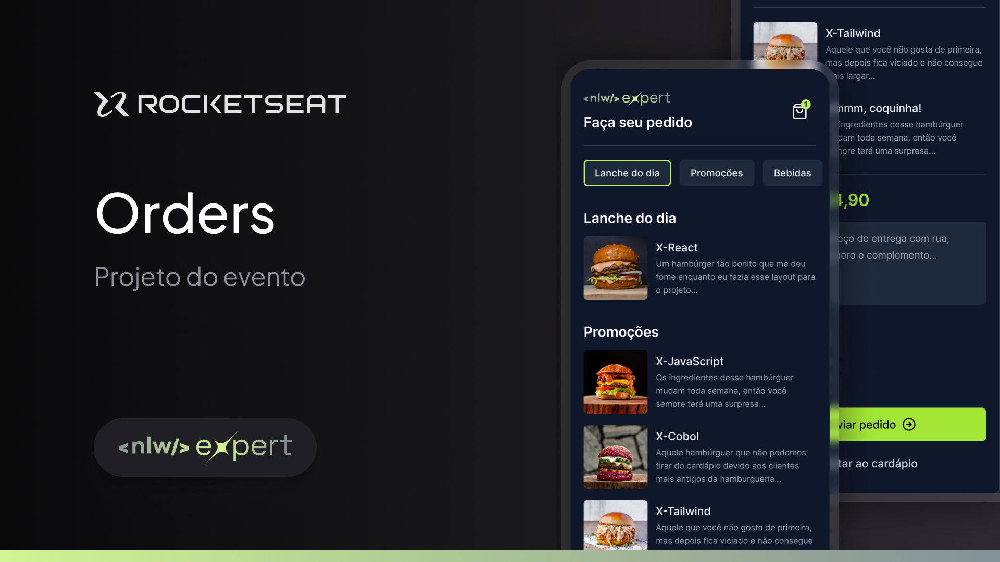

<h1 align="center"> Rocket Orders </h1>

  

 

  

## 💻 Projeto

O Rocket Orders é um aplicativo desenvolvido para restaurantes onde o cliente tem acesso ao cardápio, pode montar seu pedido, e enviar ao restaurante via whatsapp.

## 🚀 Tecnologias

Esse projeto foi desenvolvido com as seguintes tecnologias:

- React Native
- TypeScript
- Tailwind CSS
- Expo
- Figma
